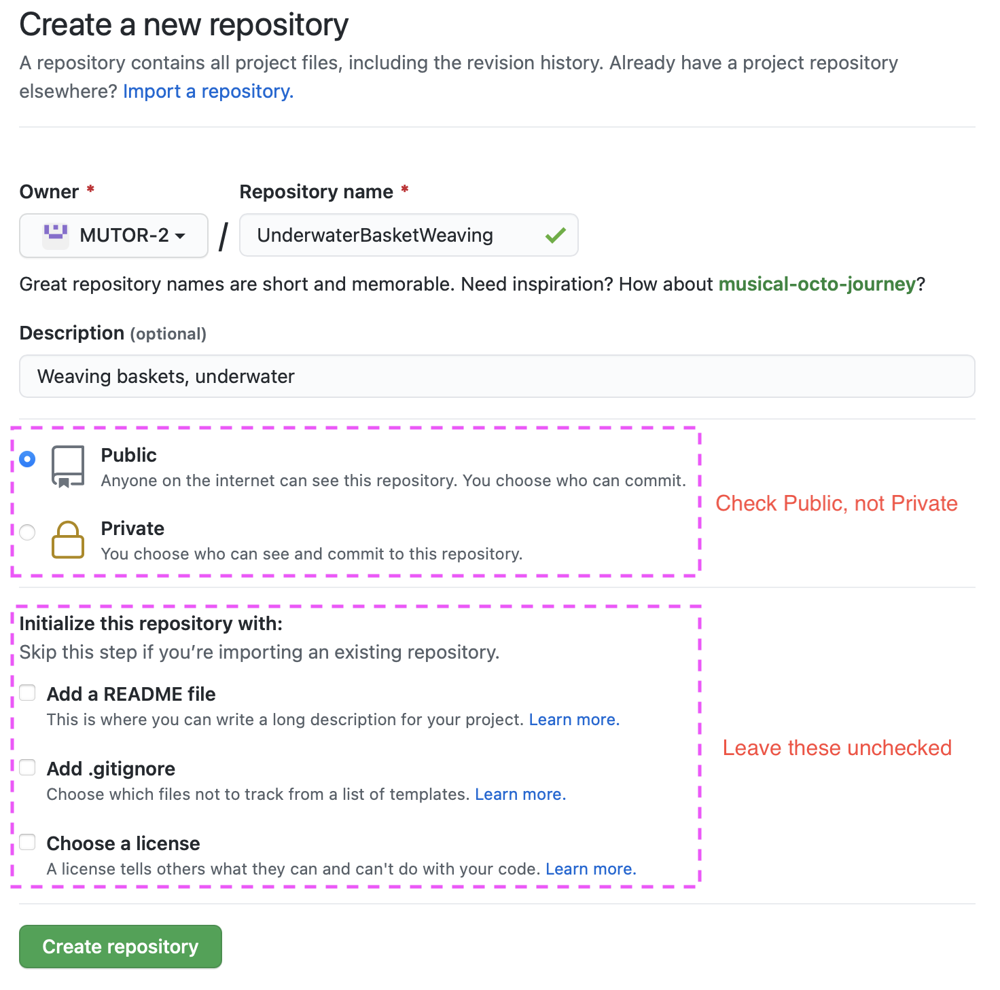
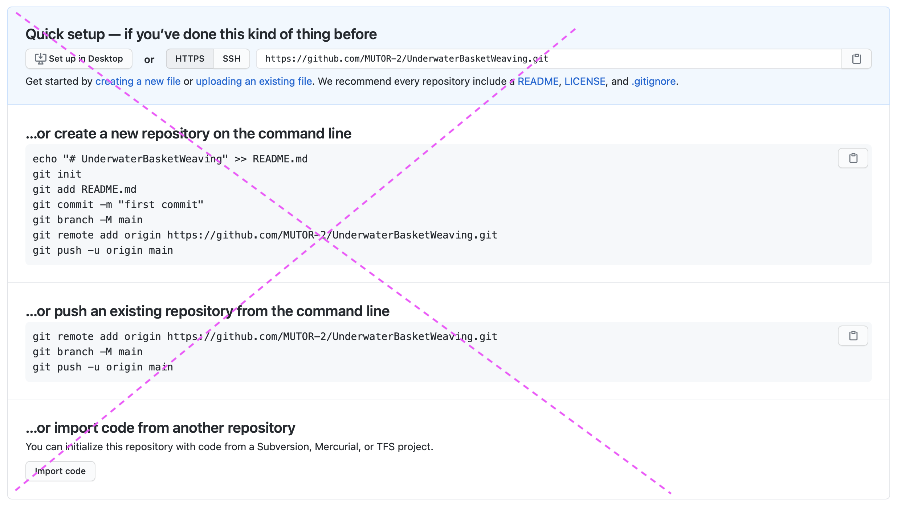

# MUTOR Template

## Setting up a new MUTOR course

In order to set up a new MUTOR course, you will begin with
a copy, not a clone, of this repository. There are a number of ways to
do this--the following steps will take you through one of them.

Let's say we want to create a course called 
[Underwater Basket Weaving](https://en.wikipedia.org/wiki/Underwater_basket_weaving).
We would start by making a new, empty repository on GitHub:
[https://github.com/organizations/MUTOR-2/repositories/new](https://github.com/organizations/MUTOR-2/repositories/new).

Be sure to NOT include a README, license or .gitignore--those will be provided
by this Template.

Ignore GitHub's post-creation instructions:

The following instructions use the commandline to set up your repo. If using
the GitHub Desktop client, they should be similar.

Make a new empty directory for the class, and initialize it as an empty
git repo:

    $ mkdir UnderwaterBasketWeaving
    $ cd UnderwaterBasketWeaving
    $ git init .
    
Next, we `pull` a copy of this template into our new repository.
This is a different process than cloning the Template repo, as it
does not set the remote origin.

    $ git pull https://github.com/mutor-2/Template
    
Now we set the remote origin to point to the GitHub repo we created above,
and set the branch to `main`:

    $ git remote add origin https://github.com/mutor-2/UnderwaterBasketWeaving
    $ git branch -M main
    
Finally, push your repo up to GitHub, setting it up to track the remote 
in the process:

    $ git push -u origin main
